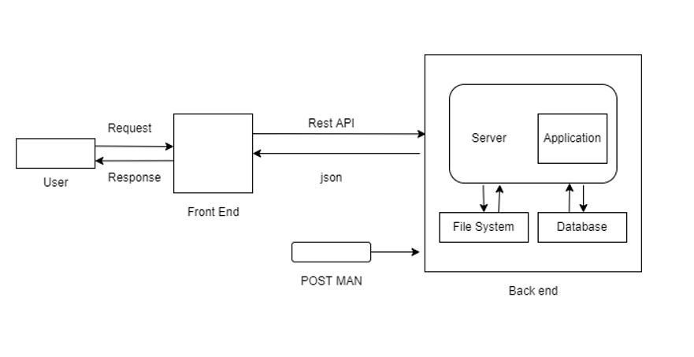

# **RRL_WheelchairWebApp**
This is the repository for the Wheelchair Web Application

Alberta Health Services is experiencing increasing problems with the supply chain for wheelchairs.  They are therefore introducing a recycling program.
 
This changes the role of the occupational therapist(OT) responsible for ordering the wheelchair. Normally if a new wheelchair is ordered a vendor participates in the assessment of the patient alongside the OT.  The vendor uses their product knowledge to help match the OT's clinical specifications to the technical characteristics of different models and sizes of wheelchairs on the market.
 
In the new model there will be no vendor present.  The OT uses a comprehensive assessment form to gather the information about the patient that specifies the requirements of the wheelchair. This clinical information has to be matched to the technical specifications of wheelchairs that AHS has on their inventory.  The OT does not normally have the same level of product knowledge and so matching patient requirements to available product characteristics is challenging and is time consuming.  For example the specification sheets of some wheelchair models can run to 8 pages!
 
The goal is to create a web application that will comprise on the back end a database of all available models of wheelchair in the AHS inventory.  In addition a user interface would be created that would collect the clinical information from the OT.  A logic driven filter would then progressively eliminate those wheelchair in the database that do not meet the clinical requirements.  In the end the user of the app is presented with those wheelchairs in the database that fit the clinical specifications.
 
Here is an example of this idea although this is not exactly what we have in mind. This is a catalog of millions of electronic components, many of which belong to categories of components but with different specifications.  The UI is clunky but I think you can see how the filter system works.
 
[ https://www.digikey.ca/en/products/filter/film-capacitors/62 ]
 
At this point we do not plan to make this a dynamic database (i.e. link the database to an inventory of items in stock) but that could be a future project.
 
### **Technologies used to develop the application**

#### **Client-Side Programming Language**

1. HTML
2. CSS
3. JavaScript

#### **Server Side Programming Language**
1. MS SQL Server
2. Node.js
3. Express.js
4. Postman 

#### **Web Application Framework**
* React JS: React JS is a frontend library that is often used as a framework to build the component-based architecture of web apps

#### **Software Tools used:**
* Brackets/VS Code IDE and Chrome web browser.

### **Proposed architecture of the application**

### **Folder Structure**
* Frontend - contains all the UI related code (HTML,CSS,JavaScript).The Frontend Folder contains 8 sub folders.
* * Alberta_Signature - contains the AHS and UofA logos and icons used in the Welcome screen and Dashboard.
* * Comprehensive_Assessment_Form - contains HTML and CSS files (CSAForm.html and CSAFormStyle.css) related to Comprehensive assessment form (CSA Form).
* * Dashboard – contains HTML and CSS files (Welcome.html,WelcomeStyle.css, ProcessingScreen.html,ProcessingStyle.css ,faq.html and faq.css) related to Welcome Screen, processing Screen and FAQ Page.
* * Generic_Order_Form – contains HTML and CSS files (GOForm.html and GOFormStyle.css) related to Generic Order Form (GO Form).
* * Javascript_Files – contains .js files which are responsible for scripts for frontend (functions.js,models.js,faq.js) 
* * Wheelchair_Models – contains HTML and CSS files (models.html and models.css) related to Available Models Page in the application.
* * Wheelchair_Size_html_tables – contains Wheelchair size HTML tables generated from the Wheelchair size excel sheet 
* * Wheelchair_Size_Tbl_Images – contains Wheelchair size tables screenshots taken from the Wheelchair size excel sheet. Maybe used later but not currently in use.

* Backend -  contains all the database and backend related code.
* Documents - contains Project related artifacts and documents such as Architecture diagram and so on.

### **How to run the frontend code (Starting Point)**
To run the application UI (launch the web page),Go to the Dashboard folder which contains Welcome.html file, Double click to open this file or Right click and open the file in your local browser ( ex. Google Chrome)

### **About the Code**
•	Functions.js – file which contains all the scripts that are used for CSA and GOF forms.
1.	function validateForm() – function which checks if all fields are filled on CSA form
2.	submitForm – function called when Submit button is clicked on CSA form
3.	updateGOFDataFunction - function called when any of the data in the input fields on Generic order form are changed.
4.	processDataFunction - function called when Submit button is clicked on Generic Order Form (GOF) Page.
5.	retrieveFormInfo - function called when Generic Order form is loaded

•	Models.js - file which contains all the scripts that are used for available Models page.
getWheelchairModels() - function called when available models page is loaded

